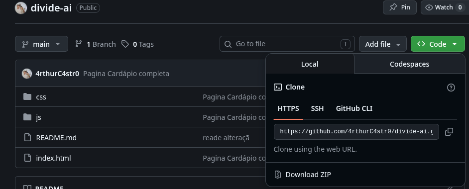

> # Divide Aí

Projeto da matéria de projeto integrador I 
-------------------------------------------------------
Para rodar o projeto pode utilizar a Extensão no VScode
 - Live Server

## instruções para colaborações

 > ### Baixar o projeto no computador



```
main (protegida) 
  ↑
  └── PR aprovado por você
        ↑
        └── branch do colaborador (feature/nova-funcionalidade)
```
A main é uma branch protegida pelo administrador, ou seja, outras pessoas não conseguem fazer modificações direto no projeto com ela (somente o admin do projeto)

