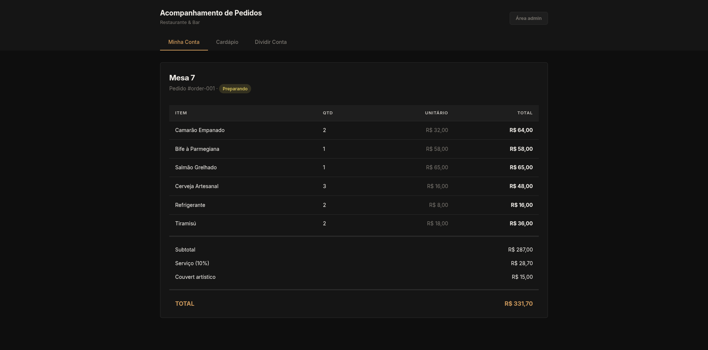
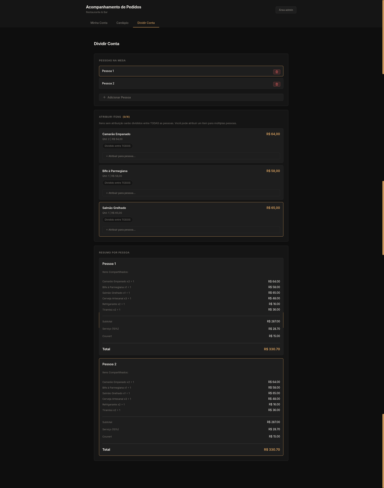
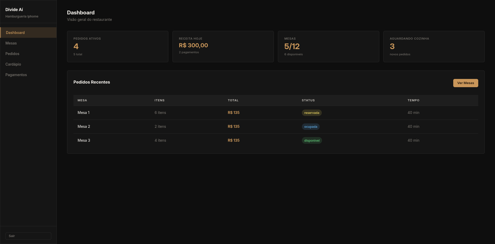
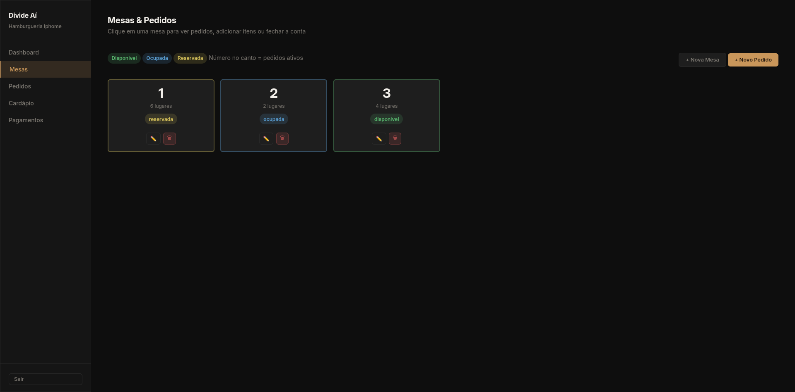
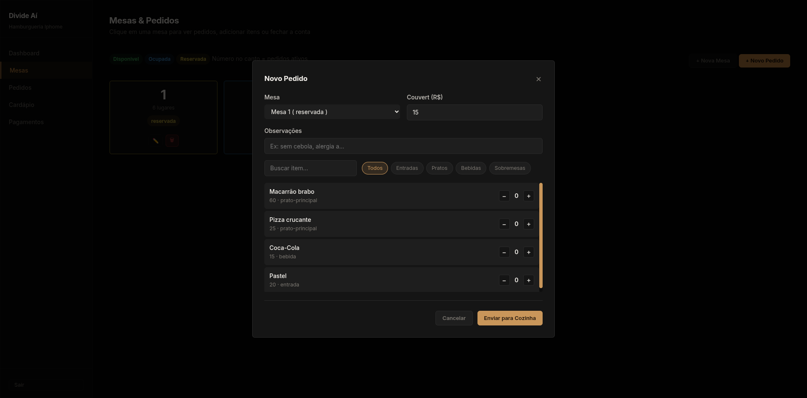
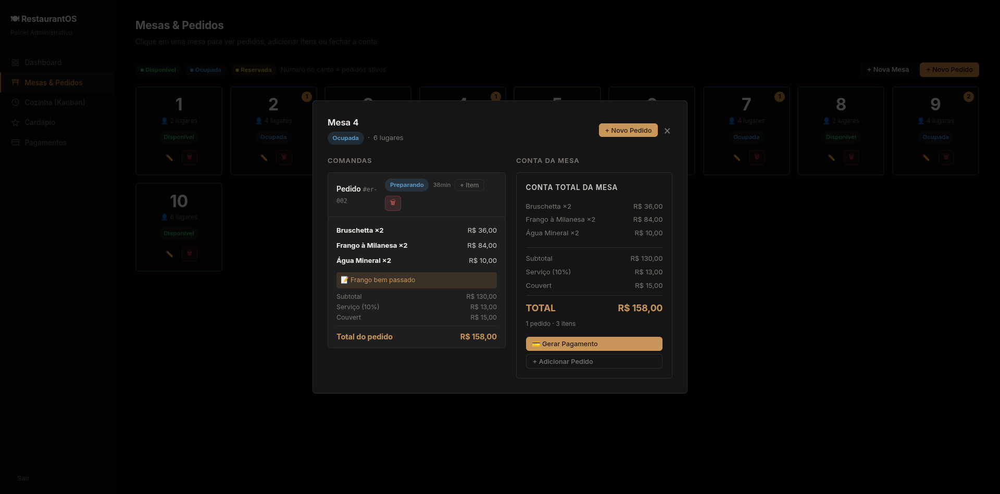
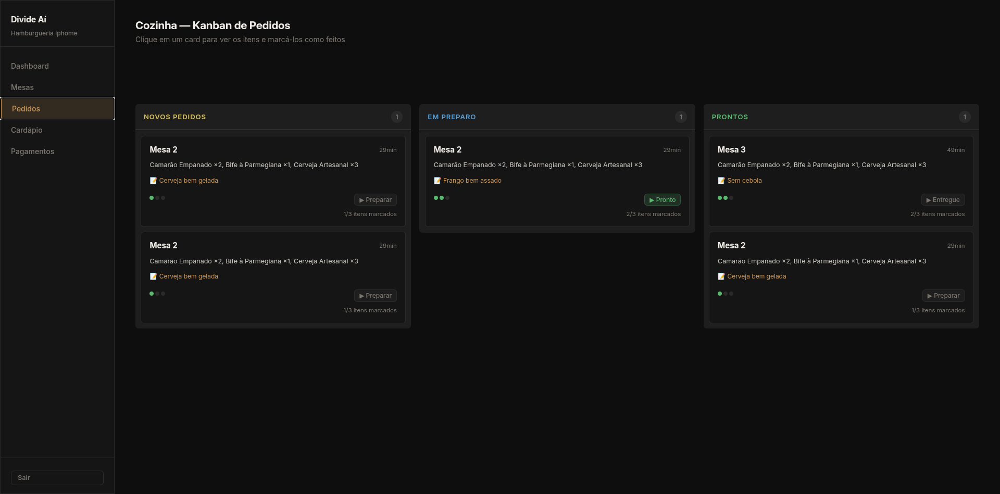
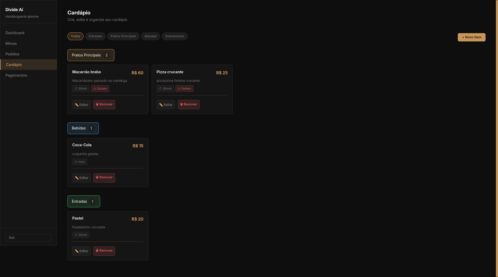
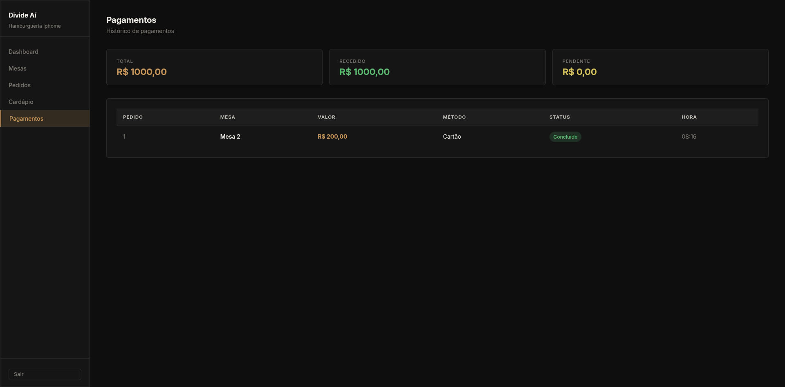

> # Divide Aí

Um trabalho da matéria de Projeto Integrador do curso de Sistemas para Internet da Universidade Estadual do Piauí

Nosso projeto tem o objetivo de reformular o cardápio digital em restaurantes, um cardápio que vai além de ver o preço, ingredientes e uma foto do item, o objetivo é trazer mais funcionalidades, mais motivos para se escanear o QR-code na mesa. 

## Os grandes diferenciais são: 
#### 1. Comanda em tempo real: 
O cliente consegue acompanhar pelo site todos os pedidos da sua comanda, tendo o controle e conhecimento do que foi pedido e do que será cobrado, desde a porcentagem do garçom até o couvert artistico.



#### 2. Dividir a conta: 
Uma das principais funções do projeto é a sessão de divisão da conta. Nela você consegue adicionar as pessoas que irão dividir a conta, consegue dividir igualmente para todos ou atribuir somente os itens especificos que cada um consumiu, e o sistema faz todo o cálculo para o cliente. 



## Sistema para o restaurante:
Também disponibilizamos o sistema completo para o restaurante administrar as mesas e pedidos:

### 1. Dashboard 

Aqui o restaurante tem uma visão geral de como estão as mesas, quantos pedidos estão ativos, pedidos recentes, etc.

### 2. Mesas




Nesta sessão é possivel adicionar/editar uma mesa, ver a disponibilidade e registrar o pedido daquela mesa.

### 3. Cozinha


Nesta aba é possivel acompanhar cada pedido da cozinha, marcar cada item como feito e atualizar o status do pedido.

### 4. Cardápio 


Aqui o restaurante registra/edita cada item do cardápio 

### 5. Pagamentos


Aqui o restaurante acompanha o andamento dos pagamentos, quais foram feitos e quais estão pendentes.

#### Integrantes: 
- Arthur Castro 
- Joab Filho
- Rian Henrique 
- Murilo Dias Crateús
- Arthur Alcantara


# Guia de Git e GitHub para Iniciantes
### Como colaborar em projetos usando Git

---

## 1. Instalação do Git

### Windows
1. Acesse [git-scm.com](https://git-scm.com/download/win) e baixe o instalador
2. Execute e avance com as opções padrão
3. Abra o **Git Bash** (instalado junto com o Git)

### macOS
```bash
brew install git
```
> Se não tiver o Homebrew: [brew.sh](https://brew.sh)

### Linux (Ubuntu/Debian)
```bash
sudo apt update && sudo apt install git
```

---

## 2. Configuração inicial do Git

Faça isso uma única vez após instalar:

```bash
git config --global user.name "Seu Nome"
git config --global user.email "seu@email.com"
```

> Use o **mesmo e-mail** da sua conta no GitHub.

---

## 3. Conectar o Git ao GitHub

### 3.1 Crie uma conta em [github.com](https://github.com) (se ainda não tiver)

### 3.2 Gere uma chave SSH

```bash
ssh-keygen -t ed25519 -C "seu@email.com"
```

Pressione **Enter** em tudo (sem senha é ok para uso pessoal).

### 3.3 Copie a chave pública

```bash
cat ~/.ssh/id_ed25519.pub
```

Copie o texto que aparecer.

### 3.4 Adicione a chave no GitHub

1. GitHub → clique na sua foto → **Settings**
2. **SSH and GPG keys** → **New SSH key**
3. Cole a chave e salve

### 3.5 Teste a conexão

```bash
ssh -T git@github.com
```

Resposta esperada: `Hi seu-usuario! You've successfully authenticated...`

---

## 4. Fluxo de Colaboração (passo a passo)

> ⚠️ A branch `main` do projeto é protegida. Você **não pode** enviar alterações diretamente — precisa criar uma branch separada e abrir um Pull Request.

---

### Passo 1 — Clonar o repositório

Faça isso **uma única vez** para baixar o projeto:

```bash
git clone git@github.com:usuario/nome-do-repositorio.git
cd nome-do-repositorio
```

> Substitua `usuario/nome-do-repositorio` pelo caminho real do projeto no GitHub.

---

### Passo 2 — Criar sua branch de trabalho

Nunca trabalhe direto na `main`. Crie uma branch com um nome descritivo:

```bash
git checkout -b minha-feature
```

Exemplos de nomes: `corrige-bug-login`, `adiciona-tela-cadastro`, `ajusta-readme`

---

### Passo 3 — Faça suas modificações

Edite os arquivos normalmente com seu editor. Quando terminar, continue para o próximo passo.

---

### Passo 4 — Salvar as alterações no Git (commit)

#### Veja o que foi alterado:
```bash
git status
```

#### Adicione os arquivos que quer salvar:
```bash
git add .
```
> O `.` adiciona todos os arquivos modificados. Para adicionar só um: `git add nome-do-arquivo`

#### Crie o commit com uma mensagem explicando o que foi feito:
```bash
git commit -m "Descrição clara do que foi alterado"
```

---

### Passo 5 — Verificar se o repositório remoto teve mudanças

Antes de enviar suas alterações, veja se alguém alterou algo no projeto enquanto você trabalhava:

```bash
git fetch origin
git status
```

Se aparecer mensagem de que sua branch está desatualizada, você precisa integrar as mudanças:

```bash
git merge origin/main
```

> Se houver **conflitos**, o Git vai indicar os arquivos. Abra-os, resolva manualmente o que ficou marcado com `<<<<<<<` e `>>>>>>>`, salve e depois:
> ```bash
> git add .
> git commit -m "Resolve conflitos com main"
> ```

---

### Passo 6 — Enviar sua branch para o GitHub

```bash
git push origin minha-feature
```

> Substitua `minha-feature` pelo nome da sua branch.

---

### Passo 7 — Abrir o Pull Request no GitHub

1. Acesse o repositório no GitHub
2. Vai aparecer um banner amarelo: **"Compare & pull request"** — clique nele
   - Ou vá em **Pull requests** → **New pull request**
3. Confirme que está comparando `minha-feature` → `main`
4. Escreva um título e descrição explicando o que foi feito
5. Clique em **Create pull request**

---

### Passo 8 — Aguardar a revisão

O administrador do projeto vai analisar seu Pull Request e pode:

| Ação | O que significa |
|------|----------------|
| ✅ **Merge** | Suas alterações foram aceitas e integradas ao projeto |
| ❌ **Close** | PR foi recusado (você receberá um comentário explicando) |
| 💬 **Pedido de alteração** | Ele vai comentar o que precisa ser ajustado |

Se pedirem alterações, faça as correções nos seus arquivos e repita os Passos 4 e 6 — o Pull Request já aberto se atualizará automaticamente.

---

## 5. Referência rápida dos comandos

```bash
git clone <url>              # Baixar o projeto (só na primeira vez)
git checkout -b minha-branch # Criar e entrar em uma nova branch
git checkout branch          # Trocar de branch
git checkout --delete branch # Deletar Branch   
git status                   # Ver o que foi alterado
git add .                    # Adicionar tudo para o commit
git commit -m "mensagem"     # Salvar no histórico local
git fetch origin             # Verificar se há novidades no remoto
git merge origin/main        # Trazer as novidades da main para sua branch
git push origin minha-branch # Enviar sua branch para o GitHub
```

---

## 6. Começando um novo ciclo de trabalho

Quando for trabalhar em algo novo (depois que seu PR anterior foi aceito):

```bash
git checkout main          # Voltar para a main
git pull origin main       # Atualizar com as mudanças mais recentes
git checkout -b nova-feature # Criar uma nova branch para o próximo trabalho
```

> Sempre parta de uma `main` atualizada para evitar conflitos desnecessários.

---

*Dúvidas? Fale com o administrador do projeto antes de qualquer push direto na `main`.*

## 7. Comandos Adicionais para git 

```bash
git branch              # Verificar qual branch está usando
```

